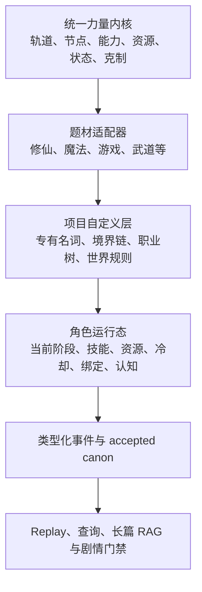
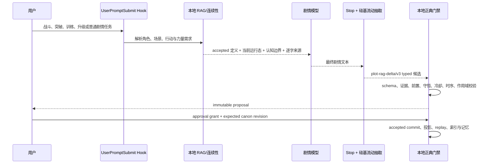

# 网文力量体系适配计划

状态：力量体系实现完成；`v1.4.2` 已补并发迁移、可移植 validator、secret scan、package/install-source 一致性与安装缓存完整性门禁，最终 cachebuster 提交、重装和真实缓存比对按发布步骤执行

目标版本线：`v1.1.0 → v1.3.0`

实现基线：`v1.0.0`（`e014269`）

最后更新：2026-07-17

本计划为 `plot-rag-gate` 增加可计算、可检索、可重放的网文力量体系内核。首批适配修仙、魔法、技能、游戏等级/职业，同时覆盖武道、异能、血脉、科技强化、契约召唤、系统流、混合体系和无超凡作品。

本文件既是实施范围真源，也是 v1.3.0 的逐项验收清单；实现已按本计划落入 schema、运行时、初始化、RAG、CLI/MCP、迁移、benchmark 与文档。后续维护版本必须继续通过 `scripts/release_gate.py validate / secrets / roundtrip`，真实重装后再通过 `verify-install` 核验 marketplace、权威源码与安装缓存。

## 1. 升级目标

升级后的插件必须能够：

1. 在初始化时把自然语言力量设定整理为统一内核，而不是只保存一段“力量体系简介”。
2. 在剧情生成前检索角色当前境界、等级、职业、技能、资源、冷却、状态、装备、契约、突破条件和已知克制。
3. 在剧情生成后抽取能力获得、使用、消耗、升级、突破、状态变化和来源绑定，并继续遵守 proposal、grant、CAS 和 accepted canon 生命周期。
4. 判断“现在能否使用某能力”“能否从当前阶段晋升”“还缺什么条件”，但不把复杂战斗压缩成单一战力数字。
5. 同时保存客观机制、角色认知、公开传闻、读者已知和作者计划，防止角色凭空知道隐藏能力或真正克制。
6. 允许一部作品拥有多条成长轨、多套并存体系和显式跨体系规则，不自动假定“十级等于筑基”。
7. 保持旧项目、旧 `ability` 事件、旧 `InitializationBundle v1` 和 config v3 可迁移、可回放、可关闭新功能。
8. 让硅基流动模型负责候选抽取、Embedding、Rerank 和含混复核；稳定 ID、规则执行、守恒、顺序、证据和正典写入仍由本地代码独占。

## 2. 借鉴边界与当前基线

`webnovel-writer` 已提供值得保留的工作流思想：

- 初始化时明确体系公理、类型、境界链、能力来源、晋级条件、资源、战斗规则、克制、禁忌和反馈节奏；
- 写作前查询角色当前境界和已有技能；
- 新技能必须有获得途径，越级展示必须先建立突破或例外；
- 章节提交后记录 `power_breakthrough` 和角色状态变化。

`plot-rag-gate v1.0.0` 已有：

- 稳定 `ability` 实体；
- `gain / set / use / cooldown / breakthrough / lose` 能力事件；
- `ability_state.state_json` 投影；
- 能力获得前不得使用的确定性门禁；
- 初始化中的核心能力、成本、边界、反制、稀缺资源和权力分布；
- accepted/rejected/retracted、correction、supersession、分支、证据和确定性 replay；
- 长篇检索、三层记忆、三级摘要和网文方法卡。

当前缺口是：能力状态仍是宽松 JSON，境界链、技能树、资源池、突破条件、克制关系和混合体系没有统一且可计算的语义。后续升级应借鉴 `webnovel-writer` 的创作入口，但继续保持本插件更严格的证据、proposal 和正典生命周期，不依赖其源码或 `.webnovel` 存储。

### 2.1 实现审计发现的 P0 前置缺口

力量专项实施前必须先修复当前能力链路，否则新 adapter 会建立在不完整投影之上：

| 编号 | 当前实现缺口 | 直接影响 |
| --- | --- | --- |
| P0-POWER-01 | strict Stop 抽取 schema 和 config 类别没有 `ability/progression/resource`，`legacy_deltas_to_events` 也没有 ability 分支 | 正文中获得、使用、突破、冷却或失去能力通常不能形成 typed ability event |
| P0-POWER-02 | 初始化本地谓词没有能力/境界/技能/功法/等级，远端虽允许 `ability.*`，但 `_dossier_from_claims` 不消费它；lifecycle adapter 只读取 `actor.capabilities` | 已有资料中独立抽取出的能力 claim 可能在标准化时丢失 |
| P0-POWER-03 | `use/cooldown/lose` 会以整包最后写覆盖持久能力状态，`lose` 仍在 `ability_state` 留行 | 使用一次能力可能抹掉等级、成本和限制；失去能力后下一提交仍可能被视为已获得 |
| P0-POWER-04 | `breakthrough` 被当作获得能力，不检查原阶段、相邻节点、资源和前置；能力端点只校验 ID 存在，不校验实体类型 | 可凭空突破，且地点可被当作 owner、角色可被当作 ability |
| P0-POWER-05 | longform continuity need 没有力量类别和 mandatory quota，现有 benchmark 也没有完整能力状态机场景 | 明确的战斗、境界和技能任务仍可能漏召回关键力量状态，发布指标无法证明正确性 |
| P0-POWER-06 | 初始化充分性只检查通用 MVW 非空项和核心能力四字段，通用占位也可能通过；当前没有题材 power profile | 初始化报告“ready”不代表力量来源、成长、资源、失败、痕迹和社会后果可推演 |
| P0-POWER-07 | 通用状态查询主要按 owner `entity_id`，按 ability 实体不能稳定反查持有者；MCP 描述与 benchmark signature 未公开覆盖力量能力 | 用户难以按技能查询持有者、当前可用性和历史，接口与质量证明均不完整 |

修复顺序必须是：**抽取可达 → 初始化不丢 → ownership/runtime 分离 → 状态机与端点校验 → longform mandatory context → adapter 扩展**。

## 3. 不可破坏的设计原则

### 3.1 定义、持有、可用和使用必须分开

- **定义**：某能力在世界规则中是什么。
- **持有**：某角色是否学会、觉醒、绑定或装备了它。
- **可用**：当前资源、冷却、状态、地点、权限和来源是否允许发动。
- **使用**：某个具体故事时点实际发动并产生了什么结果。

角色“拥有技能”不等于本场景“可以使用”，一次“观察到火焰”也不等于已经知道该能力全部机制。

### 3.2 不使用默认全局战力值

战力比较至少是条件化向量：

- 输出与破坏；
- 防御与抗性；
- 速度与先手；
- 控制与解控；
- 射程、范围与持续；
- 机动与撤退；
- 信息、隐蔽与识破；
- 续航、资源和恢复；
- 环境、准备与队友；
- 克制、免疫与规则权限；
- 使用代价和战后后果。

允许项目定义局部 `threat_band` 或系统面板战力，但它只能是项目内事实或派生指标，不能成为插件的通用真理。

### 3.3 统一内核、题材适配器、项目词汇三层分离



适配器只提供字段语义、默认问题、验证模板和术语映射，不预设某部作品必须采用固定境界名或数值曲线。

### 3.4 规则变化与角色状态变化分权

- 普通章节可以提议角色获得能力、消耗资源、进入冷却、突破或受状态影响。
- 普通章节不得静默改写全世界的境界顺序、资源换算、克制规则或能力定义。
- `PowerSystemSpec` 变化必须成为显式、高影响 proposal，绑定独立证据和 grant。
- 正文首次展示未知能力时，只记录“已观察效果”和有证据的字段；未知来源、上限和完整机制保持 `unknown`。

`PowerSystemSpec` 及定义平面的变更固定使用
`proposal_kind=power_spec_change`；只有 `bootstrap / final / published`
可以进入权威 timeless 定义，accepted outline 只进入 planned，draft 只进入对应
branch。grant operation 固定为 `accept_power_spec`。普通 `story_delta`
proposal 只允许角色运行态和观察事件。一个 proposal 同时包含 `power_spec`
与普通章节事件时整体 quarantine，必须拆成独立审阅单元。

### 3.5 信息平面继续隔离

每条能力信息都要沿用现有五个知识平面：

- `objective`：作者层客观机制；
- `actor_belief`：角色相信的机制；
- `public_narrative`：社会公开说法；
- `reader_disclosed`：正文已经向读者展示的内容；
- `author_plan`：尚未发生或尚未揭示的规划。

剧情上下文可以让模型看到作者层事实，但必须携带可见性标签，禁止把隐藏信息直接转化成角色行动依据。

### 3.6 Adapter 契约必须声明式、版本化

每个 adapter 至少实现等价职责：

```text
detect_native_terms
normalize_definition
normalize_actor_state
normalize_event
validate_transition
render_native_projection
compile_query_terms
report_semantic_loss
```

- adapter 配置只能是经过 schema 校验的声明式数据，不执行项目资料中的代码。
- 每次映射保留原生术语、adapter 版本和语义损失说明。
- adapter 间默认关系为 `unknown`；只有 accepted `BridgeRule` 才能改变。

## 4. 统一力量体系本体

### 4.1 四个数据平面

| 平面 | 内容 | 典型 scope |
| --- | --- | --- |
| 定义平面 | 体系、成长轨、阶段图、能力定义、资源规则、克制规则 | `timeless` |
| 运行平面 | 角色当前阶段、资源余额、冷却、状态、装备、契约、资格 | `current` |
| 事件平面 | 获得、使用、消耗、恢复、突破、失败、绑定、解除 | `historical/current` |
| 认知平面 | 观察、传闻、误判、保密、已确认弱点 | belief/knowledge plane |

### 4.2 核心对象

| 对象 | 最小职责 |
| --- | --- |
| `PowerSystemSpec` | 一套力量体系的稳定 ID、适配器、命名空间、公理、可见性和跨体系策略 |
| `ProgressionTrack` | 一条独立成长轴；支持线性、分支树、DAG、数值轨和状态机 |
| `RankNode` | 境界、阶位、职业阶段、血脉阶段、权限级别或装备档位 |
| `RankEdge` | 从一个节点到另一个节点的合法迁移、前置、消耗、风险和失败结果 |
| `AbilityDefinition` | 主动、被动、切换、反应、领域、仪式、生产或权限能力的规则定义 |
| `AbilityOwnership` | 角色通过何种来源持有能力，当前熟练度、升级和解锁状态 |
| `ResourcePoolDefinition` | 法力、灵力、体力、经验、弹药、热量、算力、寿命等 stock/flow 规则 |
| `ActorResourceState` | 某角色或团队在故事时点的当前量、上限、保留量、债务和恢复窗口 |
| `PowerSourceBinding` | 天赋、功法、职业、血脉、装备、契约、职位、系统、借用或消耗品来源 |
| `StatusEffectDefinition` | 增益、减益、伤势、污染、封印、姿态、领域和持续效果 |
| `ActorStatusState` | 状态层数、来源、开始/到期故事坐标、可驱散方式和影响 |
| `CounterRule` | 基于标签和条件的克制、抗性、免疫、穿透、反制或相互抵消 |
| `Qualification` | 职业、执照、宗门身份、任务旗标、装备同调、法术准备位等资格 |
| `ObservedCapability` | 角色或读者已经看见的效果，不自动等于客观完整定义 |
| `ComparisonClaim` | 带条件、知识平面、证据和置信度的局部比较，不保存无条件“必胜” |
| `NativeTermBinding` | 保存项目原词到核心本体的版本化映射，并标注无损、部分映射或不可映射 |

所有核心对象必须使用带 namespace 的稳定 ID；显示名和项目原词只能作为
`NativeTermBinding` 或 alias，不能充当主键。最低实体类型与端点矩阵如下：

| 对象/端点 | 允许实体类型 |
| --- | --- |
| ability owner | `character / group / summon` |
| ability definition | `ability` |
| power system | `power_system` |
| progression track | `progression_track` |
| rank node | `rank_node` |
| resource pool | `resource_pool` |
| status definition | `status_effect` |
| binding source | `item / ability / bloodline / contract / faction / role / system / summon` |

proposal 归一时和 accepted commit 前都要验证端点类型；未知类型进入待消歧，
已知不匹配使用 `POWER_ENTITY_TYPE_MISMATCH`，不得通过自动重注册改变原实体类型。

### 4.3 成长轨类型

`ProgressionTrack.track_kind` 至少支持：

- `ordered_rank`：练气 → 筑基、青铜 → 白银；
- `numeric_level`：1–100 级、技能熟练度、属性值；
- `branch_tree`：职业、技能树、流派分支；
- `dag`：多个前置汇入一个晋升节点；
- `state_machine`：觉醒、失控、封印、解放、返祖等状态迁移；
- `open_ended`：法则理解、权柄、声望等难以穷举的成长；
- `none`：现实题材或当前作品不使用等级链。

同一角色可以并行拥有多条轨道，例如：

```text
修为境界 + 剑道熟练 + 炼丹职业 + 宗门权限 + 本命法器成长
```

插件不得把这些轨道自动折叠为一个“综合境界”。

### 4.4 晋升边

每条 `RankEdge` 可以包含：

- `from_node_ids` 与 `to_node_id`；
- 能力、属性、资格、任务、时间、地点、导师或事件前置；
- 资源成本、保留资源和不可消耗条件；
- 成功概率是否存在及其权威来源；
- 失败、部分成功、走火入魔、降级、污染、寿命损失等结果；
- 是否允许越级、跳级、转职、洗点、重修或多路径汇入；
- 对社会身份、可进入区域、装备权限和寿命的影响。

“突破”必须匹配一条 accepted 晋升边；没有完整图时，保持 `unmodeled` 或 `unknown`，不根据常见套路自行补全。

### 4.5 能力定义

`AbilityDefinition` 至少包含以下可选维度：

- 类别：主动、被动、切换、反应、领域、仪式、生产、召唤、权限；
- 作用：伤害、治疗、防御、位移、控制、侦察、隐藏、改写规则、制造、增益；
- 目标、范围、距离、持续和作用域；
- 启动、施法、蓄力、引导、专注和中断；
- 资源成本、材料成本、装备损耗、寿命或社会代价；
- 冷却、充能、次数、技能槽和准备位；
- 前置境界、属性、职业、装备、姿态、地点和资格；
- 上限、失效边界、暴露痕迹和误用后果；
- 抗性、免疫、穿透和明确反制；
- 能力来源及来源失效后的行为；
- 对世界、制度、关系和后续剧情的影响。

### 4.6 资源与道具的边界

- 可独立持有、转移和丢失的物体继续使用 `inventory`，如灵石、药剂、弹匣、法器。
- 连续或抽象池使用 `resource`，如法力、体力、经验、热量、算力、寿命。
- 物品转化为资源时必须产生显式 `consume inventory → gain resource` 因果链。
- 资源转换必须匹配 accepted `ConversionRule`，不得临时把任意物品兑换成法力或经验。

`BridgeRule` 与 `ConversionRule` 都必须声明：

- 稳定 ID、source namespace、target namespace、方向和是否可逆；
- 优先级、适用条件、knowledge plane、有效故事区间和来源事件；
- 冲突解析策略：精确项目规则优先于 adapter 默认，较窄条件优先于较宽条件，
  同级冲突返回 `conflicted` 而不是最后写入者获胜；
- 转换比例、损耗、容量和舍入规则；未声明时不得推导；
- 图级套利检测：任何可重复闭环若能无成本净增资源，使用
  `POWER_CONVERSION_ARBITRAGE` 阻断该规则 proposal。

## 5. 类型化事件与确定性不变量

### 5.1 事件族

| 事件族 | 主要 action | 用途 |
| --- | --- | --- |
| `power_spec` | `define / amend / deprecate` | 显式变更体系、轨道、能力、资源或克制定义 |
| `progression` | `initialize / advance / regress / branch / prestige / reset` | 境界、等级、职业、血脉和权限迁移 |
| `resource` | `initialize / gain / spend / reserve / release / recover / convert / set` | 抽象资源池变化 |
| `ability` | 保留旧 action，并增加 `unlock / upgrade / charge / activate / deactivate / refresh` | 能力持有、成长和使用 |
| `status_effect` | `apply / stack / refresh / remove / expire` | 增益、减益、污染、封印、领域和姿态 |
| `power_binding` | `bind / unbind / equip / unequip / contract / summon / dismiss / suppress` | 能力来源、装备、契约和召唤关系 |
| `qualification` | `grant / revoke / consume / expire` | 职业、许可证、任务旗标、同调和准备位 |
| `power_observation` | `observe / infer / confirm / disprove` | 已展示效果、误判和机制揭示 |

旧 `ability` 事件继续可读；迁移后被解释为能力持有/运行态的兼容子集。

### 5.2 本地强制不变量

1. **合法晋升**：目标节点必须可由当前节点经 accepted `RankEdge` 到达。
2. **前置满足**：境界、技能、资格、装备、任务、地点和时间条件必须满足。
3. **资源守恒**：除明确允许的债务或透支外，资源不得变为负数；不得无来源增加。
4. **冷却按故事时间计算**：不能使用真实墙钟时间代替章节内故事坐标。
5. **能力来源有效**：装备已卸下、契约解除、职位被撤或召唤物消失后，相关能力按定义失效。
6. **能力使用可执行**：持有、可用、资源、冷却、状态、目标、距离和作用域同时通过。
7. **状态时序有效**：状态不能在施加前生效，过期后不能继续提供效果。
8. **唯一绑定有效**：声明唯一的本命物、契约位或职业槽不能同时绑定冲突对象。
9. **转换有规则**：跨资源、跨体系和物品转资源都需要 accepted 转换边。
10. **克制有来源**：只有已定义规则或已观察证据可以形成克制；不得为当前敌人临时生成完美克制。
11. **规范与状态分权**：普通角色事件不能顺带改写 `PowerSystemSpec`。
12. **知识不越权**：角色行动只能使用其 belief/known 范围内的信息。
13. **证据连续逐字**：所有 proposal delta 继续携带最终 assistant 文本中的连续逐字证据。
14. **生命周期不变**：Stop 只保存 proposal；accepted grant 和 canon revision CAS 通过后才进入投影。
15. **动作真值唯一**：事件顶层 `action` 是唯一动作真值，嵌套 state 不得覆盖它。
16. **延迟代价可追踪**：未来才结算的反噬、债务或污染必须创建带 due coordinate 的 open loop。
17. **召唤物是独立 Actor**：召唤物拥有自己的位置、伤势、资源和能力，不能退化为无状态道具。
18. **端点类型匹配**：owner、ability、system、track、rank、resource 和 status 实体类型必须符合事件合同。

### 5.3 故事时间坐标

冷却、到期、恢复和晋升时间条件只使用可比较的 `StoryCoordinate`：

```json
{
  "calendar_id": "project-main",
  "ordinal": 12345,
  "label": "第三卷第十二日酉时",
  "precision": "watch",
  "source_event_id": "event:..."
}
```

- `ordinal` 是项目日历内的单调整数刻度，calendar 不同则不可比较；
- 自由文本 `story_time` 保留为 `label`，只有 accepted 时间规则或显式映射才能产生
  `ordinal`；
- 坐标缺失、精度不足、calendar 冲突或顺序未知时，冷却/到期校验 fail-closed，
  返回 `POWER_STORY_COORDINATE_UNKNOWN`；
- 章节号、场景号和真实墙钟都不能替代故事时间；
- correction、supersession 和 retraction 后坐标投影必须由 accepted 事件重放。

### 5.4 建议错误码

| 场景 | 错误码 |
| --- | --- |
| 未获得或已经失去能力 | `POWER_ABILITY_NOT_ACQUIRED` |
| 境界、技能、资格或装备前置不足 | `POWER_PREREQUISITE_UNMET` |
| 资源不足、重复消费或守恒失败 | `POWER_RESOURCE_INSUFFICIENT` |
| 冷却或次数窗口未恢复 | `POWER_COOLDOWN_ACTIVE` |
| 必需媒介、姿态、地点或时间不满足 | `POWER_CONTEXT_CONDITION_UNMET` |
| 没有合法晋升边 | `POWER_TRANSITION_EDGE_MISSING` |
| 即时代价未在同一事务写回 | `POWER_COST_NOT_APPLIED` |
| 延迟代价没有剧情债务 | `POWER_DEFERRED_COST_UNTRACKED` |
| 没有 Bridge/ConversionRule | `POWER_INTERACTION_UNKNOWN` |
| 转换图存在无损增益套利环 | `POWER_CONVERSION_ARBITRAGE` |
| objective/public_narrative/actor_belief 平面互相覆盖 | `POWER_KNOWLEDGE_PLANE_LEAK` |
| 事件端点实体类型错误 | `POWER_ENTITY_TYPE_MISMATCH` |
| 故事时间坐标不可比较 | `POWER_STORY_COORDINATE_UNKNOWN` |
| 普通 proposal 夹带全局力量规范变更 | `POWER_SPEC_PROPOSAL_REQUIRED` |

## 6. 题材适配器

### 6.1 适配器矩阵

| profile | 主要成长轨 | 常见资源/来源 | 专项规则 |
| --- | --- | --- | --- |
| `cultivation` 修仙 | 大境界、小境界、炼体、神魂、道意、职业 | 灵力、神识、寿命、丹药、功法、灵根、法器 | 根基质量、瓶颈、天劫、心魔、因果、领域、越阶代价 |
| `magic` 魔法 | 法术环阶、学派、施法者等级、专精、仪式权限 | 法力、法术位、材料、专注、魔杖/法器 | 准备法术、施法时间、材料、打断、反制、抗性、免疫 |
| `skill_tree` 技能 | 技能等级、熟练度、天赋树、被动树、槽位 | 技能点、训练时长、导师、领悟、使用次数 | 前置技能、互斥分支、主动/被动/切换、熟练阈值、洗点 |
| `game` 游戏升级 | 角色等级、职业、转职、属性、声望、装备档位 | 经验、任务旗标、金币、体力、蓝量、装备、成就 | 等级门槛、职业树、技能槽、装备位、冷却、实例/副本规则、重置 |
| `martial` 武道 | 境界、内力、体魄、招式熟练、武意 | 气血、内力、经脉、兵器、师承 | 架势、距离、伤势、经脉、内外功冲突、武意压制 |
| `superpower` 异能 | 觉醒阶段、输出、控制、负荷、兼容性 | 精神力、体力、污染、药剂、媒介 | 失控、过载、能力冲突、暴露风险、抑制装置 |
| `bloodline` 血脉 | 纯度、觉醒阶段、返祖、突变分支 | 血脉因子、祭品、族群资格、污染 | 遗传、兼容、排异、返祖、污染、后代和身份后果 |
| `technology` 科技强化 | 义体档位、装甲代际、权限、软件/算法等级 | 能源、热量、弹药、算力、带宽、维护件 | 过热、供能、兼容接口、授权、维护、故障、供应链和入侵 |
| `contract_summoning` 契约召唤 | 契约位、召唤物阶段、亲和、控制权限 | 精神负担、媒介、祭品、共享能量 | 控制距离、忠诚、共享伤害、反噬、死亡、解除和转移 |
| `system_assist` 系统流 | 宿主等级、模块版本、权限、任务链、商城等级 | 积分、任务奖励、权限点、冷却、次数 | 面板真假、任务条件、奖励来源、模块解锁、越权代价、系统目的 |
| `hybrid` 混合 | 多命名空间并行 | 各体系独立或显式桥接 | 换算、冲突、隔离、跨体系克制和信息壁垒 |
| `mundane` 无超凡 | 职业资历、技能熟练、社会权限，可全部为 `none` | 时间、金钱、体力、关系、设备 | 不强制生成境界链、法力池或战力比较 |

### 6.2 修仙专项

- 大境界和小境界是两层节点，不把“筑基三层”当自由文本。
- 功法是能力来源与成长路径，术式是能力，法器是 inventory + binding，灵根/体质是资格或血脉轨。
- 突破应记录资源、积累、悟性/法理、地点、劫难、失败分支和根基变化。
- 高层力量可以表现为法相、法域、规则解释、空间节点、因果和制度权柄，不只增加速度与破坏数值。
- 越阶反杀必须落在信息差、准备、环境、一次性资源、伤势、克制或代价上。

### 6.3 魔法专项

- 区分学会、准备、拥有施法位、当前有法力和实际完成施法。
- 材料、手势、语言、专注、施法时间和装备焦点均可成为独立前置。
- 反制法术必须匹配窗口、识别、距离和资源，不能默认任何法师都能无条件反制。
- 仪式魔法应记录参与者、地点、时长、材料和中断结果。

### 6.4 技能与游戏专项

- 技能树是图，不是技能名数组；前置、互斥、技能点、熟练度和槽位分别建模。
- 角色等级、职业等级、技能等级和装备等级互不替代。
- 经验、属性点、技能点、声望和货币是不同资源池。
- 系统面板可能是客观规则、角色界面、误导性界面或作者展示层，必须标明知识平面。
- 任务奖励必须有任务完成证据和奖励来源；副本内规则不得无条件外溢到世界常态。

### 6.5 混合体系专项

每个体系拥有独立 namespace：

```text
cultivation.realm
magic.circle
game.character_level
technology.authorization
```

只有 accepted `BridgeRule` 才允许：

- 阶位近似或比较；
- 资源转换；
- 某体系抵抗、穿透或识别另一体系；
- 装备、职业或血脉跨体系提供能力；
- 一套体系压制、污染、封锁或兼容另一体系。

没有桥接规则时，查询结果应返回“不可直接换算”，而不是根据名称或数字猜测强弱。

## 7. 初始化流程适配

### 7.1 `new` 模式

在“题材合同 → 世界因果核 → 人物锚点 → 剧情发动机 → 连载兑现合同”中插入一个自适应 **力量因果核**，最少确认：

1. 作品是否存在超凡、等级、职业或系统化技能。
2. 力量从哪里来，谁控制入口。
3. 有哪些独立成长轨，哪条是主角当前主轨。
4. 资源如何获得、消耗、恢复和被垄断。
5. 能力以什么语法组合，哪些是硬边界。
6. 晋升需要什么，失败会留下什么。
7. 克制、抗性、撤退和保命机制是什么。
8. 力量如何改变身份、法律、阶层、经济和日常生活。
9. 第一卷实际会触达哪些节点，不为远期世界机械填满百科。

稀疏 seed 只生成少量决策包；若用户选择无超凡或弱体系，跳过不相关问题。

力量充分性门禁不再使用“MVW 任意若干字段非空”代替专项校验。进入 `plot_ready` 前至少满足：

- profile 为明确 adapter、`hybrid` 或 `mundane/not_applicable`；
- 力量来源和获得入口可追踪；
- 当前剧情触达的成长轨与节点可识别；
- 至少一条资源获取—消耗—恢复链成立，或明确声明不使用资源池；
- 核心能力拥有来源、触发、成本、边界、反制和使用痕迹；
- 当前卷涉及的晋升拥有前置和失败结果；
- 力量对身份、组织、法律、经济或日常生活至少有一项可验证影响；
- 占位词“主线相关能力”“关键资源”等不能单独通过门禁。

### 7.2 `ingest` 模式

只读整理现有资料时：

- 识别项目原词，不强行把“序列”“环阶”“权限”“星级”改名为“境界”；
- 抽取体系、轨道、节点、边、能力、资源、来源、状态、克制和换算 claim；
- 把“明确规则”“角色推测”“大众传闻”“正文已展示”分层；
- 保留断链、环路、缺失前置、同名异义、数值冲突和未定义换算；
- 只对原文明示内容建模，不用常见题材知识补齐空白。

### 7.3 `hybrid` 模式

先 ingest，再只补阻塞目标档位的缺口。例如：

- 当前境界存在，但上一个节点或晋升条件缺失；
- 已写角色使用法术，但法力/次数/材料规则不清；
- 游戏等级与职业等级混用；
- 两套体系发生对抗，但没有桥接或克制规则；
- 角色能力有名称，缺少来源、代价、边界或获得事件。

### 7.4 InitializationBundle 升级

新增独立 `plot-rag-power/v1` schema，并由 `InitializationBundle v2` 引用：

```text
InitializationBundle v2
├─ 原 v1 全部模块
├─ power_systems[]
├─ progression_tracks[]
├─ rank_nodes[]
├─ rank_edges[]
├─ ability_definitions[]
├─ resource_definitions[]
├─ counter_rules[]
├─ bridge_rules[]
└─ actor_power_bootstrap[]
```

兼容规则：

- 永不原地修改 `InitializationBundle v1` 的既有含义。
- v1 读取适配器生成 `power_model_status=unmodeled`，保留原始能力 JSON。
- 只有原文证据充分的字段进入 v2；缺失项保持 `unknown/deferred/conflicted`。
- v2 proposal 仍经过 frozen package、grant、apply、typed bootstrap commit 和 verify。

版本协商固定为：

1. config validator 只接受 `plot-rag-init/v1`、`plot-rag-init/v2` 或
   `auto`；`auto` 在存在结构化力量模型时产出 v2，否则保持 v1。
2. initialization session、normalized dossier、frozen proposal 和 completion
   receipt 都显式保存 `bundle_schema_version`。
3. canonical hash 必须包含 schema version、power package、knowledge planes、
   provenance、source manifest 和 adapter versions。
4. storage 可以并存读取 v1/v2；写入时只写 session 已协商的版本。
5. lifecycle adapter 按 bundle version 生成 typed bootstrap events；v2 apply
   继续使用 `proposal_kind=initialization_bundle` 和现有初始化 grant，同时验证
   power schema 与端点类型；初始化完成后的独立定义变更才使用
   `power_spec_change / accept_power_spec`。
6. verify 同时核对 bundle hash、materialized artifact hash、accepted event hash
   和 replay projection hash。
7. v2 读取器遇到 v1 时返回显式 `v1_fallback` 和
   `power_model_status=unmodeled`，不静默伪造 v2 对象。

### 7.5 标准文件投影

保留现有 `设定集/规则与力量.md` 作为兼容总览。深度力量体系项目可增加：

```text
设定集/
  规则与力量.md
  力量体系/
    00_体系总览.md
    01_成长轨与阶段图.md
    02_资源与晋升条件.md
    03_能力技能与来源.md
    04_状态克制与战斗边界.md
    05_装备血脉契约与职业.md
    06_社会权限与阶层后果.md
    07_跨体系换算与术语表.md
```

是否拆分由内容规模决定；原始资料保持原位，标准文件仍通过 artifact manifest 和逐文件 diff materialize。

## 8. 剧情 Hook 与 RAG 流程

目标实现只保留一个 Stop 输出协议：`plot-rag-delta/v3`。每个 delta 直接携带
`event_type` 与顶层 `action`，普通连续性和力量事件使用同一 envelope。
`plot-rag-power/v1` 只定义力量本体，不是第二套 Stop envelope。

旧 `category + set/delete` delta 仅由本地 deterministic compatibility adapter
读取并转换为 typed event；当前硅基流动 prompt 不再生成旧 shape。typed action
与 legacy category 的映射必须有单元测试，无法无损映射时 quarantine。



### 8.1 自动生成的原子检索需求

涉及力量体系时，prepare 最多生成一至五条任务相关需求，例如：

- `ACTOR 当前 progression/resource/status/binding`
- `ABILITY 定义、前置、成本、冷却、目标和边界`
- `OPPONENT 已知/传闻/隐藏能力与认知来源`
- `SCENE 地形、领域、封锁、规则和环境修正`
- `ACTION 晋升边、任务条件、装备资格或跨体系 BridgeRule`

### 8.2 Mandatory context

| 任务 | 必须注入 |
| --- | --- |
| 战斗/追逐 | 双方当前可用能力、资源、冷却、伤势/状态、距离环境、已知克制、撤退能力 |
| 突破/升级 | 当前节点、目标边、前置、资源、失败结果、社会/身份后果 |
| 训练/领悟 | 当前熟练度、训练来源、导师/材料/时间条件、可解锁节点 |
| 装备/炼制 | 物品所有权、装备位/同调、材料消耗、维护和能力绑定 |
| 系统任务/奖励 | 任务状态、完成证据、奖励表、权限和冷却 |
| 契约/召唤 | 契约位、对象状态、距离、共享资源、忠诚/控制和反噬 |

定义平面和当前运行态优先于相似正文片段。角色未知但作者层已知的信息必须明确标注，不得混入角色可用知识。

力量 need 必须作为独立 `continuity_risk` 参与方法卡过滤；通用 `current_state` mandatory need 不能把“升级资源账”“能力代价”等力量方法卡排除。

## 9. 查询、比较与接口规划

### 9.1 新增只读能力

| MCP | CLI | 返回 |
| --- | --- | --- |
| `list_power_systems` | `power systems` | 项目中的体系、profile、namespace 和建模状态 |
| `query_power_state` | `power state` | 角色当前轨道、能力、资源、冷却、状态、绑定和资格 |
| `query_progression_path` | `power path` | 从当前节点出发的合法边、已满足前置和阻塞项 |
| `explain_power_action` | `power explain` | 某角色当前能否执行指定能力/突破，以及确定性原因 |
| `compare_power_conditions` | `power compare` | 条件化优势矩阵、已知/未知项、决定条件和证据 |

所有写入继续走 `propose_plot_turn → accept_plot_proposal`，不提供绕过 proposal/grant/CAS 的“直接升级角色”工具。

只有经过缺失数据库、WAL/SHM 和已有数据库零写入测试的工具才可标记 `readOnlyHint=true`。

兼容 `query_plot_state` 时同时支持 owner、ability target、system、track 和 resource 端点检索，避免用技能名解析出 ability 实体后反而查不到持有者。

五个查询共享参数合同：

- `project_root`、`mention/entity_id`、`chapter_no`、`scene_index`、`branch_id`；
- `knowledge_planes[]`，默认只含 `objective` 与调用角色可见的
  `actor_belief/public_narrative/reader_disclosed`，`author_plan` 必须显式请求；
- `include_historical/include_provisional` 默认均为 false；
- `system_id/track_id/ability_id/resource_id/action_id` 按工具需要选用；
- 返回 `canon_revision`、projection hash、source event IDs、knowledge plane、
  unknown/conflicted 项和 deterministic reason codes。

`power systems` 允许没有 actor；`power state/path/explain/compare` 的端点必须解析为
唯一稳定 ID，否则返回待消歧而不是猜测。CLI 与 MCP 使用同一 service 函数。
每个工具都要验证缺数据库、仅有 WAL/SHM sidecar、已有数据库三种状态下
文件集合、hash、size 和 mtime 零变化后，才标记 `readOnlyHint=true`。

### 9.2 比较结果合同

`compare_power_conditions` 不输出无条件胜者。结果是查询时派生的
`ComparisonClaim`，固定标记 `derivation=query_time`、`persisted=false`，
只引用 accepted 输入和逐事件证据，不进入正典。返回：

```json
{
  "baseline": "conditional",
  "advantages": [],
  "disadvantages": [],
  "decisive_conditions": [],
  "known_to_actor": [],
  "unknown_or_conflicted": [],
  "counter_evidence": [],
  "confidence": 0.0,
  "source_event_ids": []
}
```

若设定不足，结果是 `insufficient_model`；若两套体系无桥接，结果是 `not_directly_comparable`。

## 10. 硅基流动职责

### 10.1 允许承担

- 从用户资料和最终剧情文本中抽取 `plot-rag-delta/v3` 中的力量事件候选；
- 为体系规则、能力、资源、状态和克制片段生成 Embedding；
- 对本地召回候选做 Rerank；
- 在本地规则无法判定的语义含混项上做可选复核；
- 给出术语映射候选和置信度。

### 10.2 禁止承担

- 生成稳定实体 ID、事件 ID 或 grant；
- 决定 accepted/rejected；
- 修改 canon revision；
- 自行补全境界链、技能前置、资源换算或克制规则；
- 判定唯一所有权、资源守恒、冷却时序和合法晋升；
- 把模型常识当项目事实。

### 10.3 抽取 schema

远端输出只允许包含：

- 已解析或待解析的体系/轨道/能力/资源 ID；
- 枚举化 event family 和 action；
- old/new 或 delta；
- 故事坐标；
- 连续逐字 evidence；
- 置信度、歧义和建议 knowledge plane。

本地代码负责把候选绑定到 accepted 定义，执行前置、守恒、时序和 scope 校验。远端超时、限流、错误 JSON 或空结果时，不得创建 accepted delta；精确状态查询和本地词法召回继续工作。

远端安全约束继承现有 SiliconFlow 边界：只允许 HTTPS；credential 请求 host
必须在 allowlist；共享 key 只发送到 `api.siliconflow.cn`；携带 credential
的 redirect 一律阻断；cache key、日志、proposal、benchmark 和错误对象递归去敏，
不得保存 Authorization header、环境变量值或用户提供的 key。

## 11. 存储、版本和迁移

### 11.1 版本规划

| 组件 | 当前 | 目标 |
| --- | --- | --- |
| project config | v3 | 保持 v3，新增可选 `power_system` 配置块 |
| continuity schema | v4 | v5，新增力量定义与运行投影 |
| initialization protocol | `plot-rag-init/v1` | 新增 v2，保留 v1 读取 |
| power schema | 无 | `plot-rag-power/v1` |
| authority index | 当前版本 | 仅在需要结构化 power chunk 元数据时独立升级 |

建议配置：

```json
{
  "power_system": {
    "mode": "auto",
    "schema_version": "plot-rag-power/v1",
    "strict_progression": true,
    "comparison_mode": "conditional",
    "unknown_policy": "quarantine",
    "profiles": []
  }
}
```

### 11.2 新投影

建议增加：

- `power_system_specs`
- `progression_tracks`
- `rank_nodes`
- `rank_edges`
- `ability_definitions`
- `resource_definitions`
- `counter_rules`
- `bridge_rules`
- `actor_progression_state`
- `actor_resource_state`
- `actor_ability_state`
- `actor_status_state`
- `power_bindings`
- `qualification_state`
- `power_observations`

定义表来自 active accepted `power_spec`；运行表全部可从 immutable accepted event 重放。

### 11.3 旧数据迁移

1. 迁移前备份数据库并记录计数与哈希。
2. 权威迁移源是 active immutable accepted events；先在空投影上 replay，再生成
   v5 力量投影，不能把可能已损坏的旧 `ability_state` 行当作正典。
3. 只有缺少 accepted 事件账本的 legacy 数据才允许兼容导入
   `ability_state.state_json`；导入事件必须标记
   `provenance.kind=legacy_projection_import`、原数据库 hash 和不确定字段。
4. 已有 `level / cost / cooldown / limits / status` 只按原值迁移，不推导缺失规则。
5. 自由文本“境界”若没有 accepted 顺序，只生成 observed/current label，不自动建立 `RankEdge`。
6. 旧初始化 bundle 继续有效；需要严格力量模型时通过 ingest/hybrid 生成新 proposal。
7. accepted commit、event ID、source event 引用和 canon revision 保持不变。
8. 新验证先以 `shadow` 模式报告，不阻断旧项目；完成力量初始化并显式启用后进入 strict。
9. 回滚恢复迁移前备份或关闭配置块，不手工修改 SQLite 行。

## 12. 代码实施面

| 实施面 | 计划修改/新增 |
| --- | --- |
| 核心模型 | 新增 `scripts/power_system/model.py`、`adapters.py`、`queries.py` 和声明式 `knowledge/power_adapters/` |
| JSON schema | 新增 `schemas/plot-rag-power/v1/*.json`、`schemas/plot-rag-init/v2/*.json` |
| 连续性账本 | 修改 `continuity/schema.py`、`validators.py`、`service.py`、`replay.py`，拆分 ownership/runtime 并修复 lose/use 状态机 |
| 初始化 | 修改 `plot_init/inventory.py`、`constants.py`、`engine.py`、`normalized.py`、`lifecycle_adapter.py`、`remote_model.py`，确保力量 claim 不丢失并增加专项充分性门禁 |
| 剧情运行时 | 修改 `state_rag.py`、`v1_runtime.py` 和 `templates/config.v3.json`，让 strict Stop 可抽取并归一力量事件 |
| 长篇召回与投影 | 修改 `longform/continuity.py`、`memory.py`、`projections.py`、`methods.py`，增加力量 need、quota、摘要、方法过滤与剧情债务 |
| CLI/MCP | 修改 `plot_state.py`、`plot_rag_mcp.py`，增加五个只读查询 |
| 配置 | 扩展 `templates/config.v3.json` 和 config validator |
| 方法包 | 增加突破、战斗读法、技能树、混合体系和力量社会后果方法卡 |
| 测试 | 新增 `tests/test_power_continuity.py`、adapter contract、迁移、RAG、SiliconFlow；修改 `longform/benchmarking.py` 与 fixture generator，增加力量签名和标注集 |
| 文档 | 更新 README、SKILL、CHANGELOG、初始化框架和迁移说明 |

## 13. 分阶段版本计划

### v1.1.0：P0 能力闭环、力量定义与初始化

实施范围：

- [x] 扩展 strict Stop 抽取类别和 `legacy_deltas_to_events`，使能力获得、使用、冷却、突破和失去都能到达 typed continuity。
- [x] 修复 `ability.*` 初始化 claim 到 dossier/bundle/bootstrap event 的完整传递。
- [x] 建立 continuity schema v5 基础，分离 ability ownership、runtime/use history，并校验 owner/ability 实体类型。
- [x] 修复 `gain → use → lose → use`、`lose-before-gain`、动作覆盖持久状态和 `breakthrough` 凭空获得等 P0 状态机问题。
- [x] 冻结 `plot-rag-power/v1` 和 `InitializationBundle v2`。
- [x] 实现统一对象、profile registry 和项目词汇映射。
- [x] 实现 `new / ingest / hybrid` 力量因果核。
- [x] 首批完成 `cultivation / magic / skill_tree / game / mundane` adapter。
- [x] 输出兼容总览和可选力量体系目录。
- [x] 增加 `list_power_systems` 和只读 schema 诊断。

退出条件：

- strict Stop 中的能力变化能够形成带逐字证据的 typed proposal。
- `use/cooldown` 不再抹掉等级、成本、限制和持有状态。
- 已失去或从未获得的能力不能在后续提交中使用。
- `breakthrough` 不再隐式等于 gain；错误实体类型在 proposal 阶段被阻断。
- ingest 的 `ability.*` claim 在 bundle 与 bootstrap commit 中字段保真。
- 四个核心题材和无超凡 fixture 都能生成确定性 bundle。
- 同输入 bundle hash 稳定，原始资料零改动。
- 无超凡作品不生成伪境界链。
- 自由文本境界不会在缺少证据时被自动排序。

### v1.2.0：类型化运行态与确定性门禁

实施范围：

- [x] 扩展 continuity schema v5 的 progression/resource/status/binding/qualification 投影及迁移/回滚。
- [x] progression、resource、status、binding、qualification、observation 事件。
- [x] 能力使用、晋升、资源、冷却、状态、来源和转换不变量。
- [x] accepted/retracted/superseded/replay 全链覆盖。
- [x] 完成武道、异能、血脉、科技、契约召唤、系统流 adapter。
- [x] 实现 `query_power_state / query_progression_path / explain_power_action`。

退出条件：

- 非法跳阶、未获得技能、资源不足、冷却未结束、来源失效和资格不足均被阻断或 quarantine。
- correction、retraction 和 supersession 后投影与重放哈希一致。
- 旧 ability 事件迁移后查询结果不丢失。
- 普通章节不能静默修改全局力量规则。

### v1.3.0：混合体系、力量 RAG 与质量评估

实施范围：

- [x] BridgeRule、跨体系克制、隔离和转换图。
- [x] 力量 mandatory context 和任务级原子检索。
- [x] `compare_power_conditions` 条件化比较。
- [x] 硅基流动 power delta 严格抽取与含混复核。
- [x] 力量摘要、升级资源账、冷却债务、突破债务和能力揭示债务进入长篇召回。
- [x] 版本化 benchmark、规模测试和合成 fixture shadow 试点。

退出条件：

- 没有 BridgeRule 时不做跨体系数值换算。
- 战斗、突破、训练、装备、系统奖励和契约场景的 mandatory context recall 达标。
- 隐藏能力不会被写成角色已知事实。
- 危险候选全部进入本地 validator，远端模型不能绕过正典门禁。

## 14. 测试矩阵

### 14.1 Adapter contract

每个 profile 至少验证：

- 术语到统一对象映射；
- 合法与非法晋升；
- 资源获得、消耗、恢复和转换；
- 能力前置、使用、冷却和失效；
- 状态、抗性、克制和反制；
- 来源绑定与解除；
- 项目自定义词汇覆盖默认词汇；
- unknown/conflicted/deferred 保留；
- replay 确定性。

### 14.2 关键端到端案例

- 基线修复：strict Stop 从正文“获得、使用、进入冷却、突破、失去”生成 typed proposal。
- 基线修复：`gain(level/cost/limits) → use` 后持久字段仍完整。
- 基线修复：`gain → lose → 下一提交 use` 被阻断。
- 基线修复：先 `lose` 从未获得能力，不能因此制造可用 ownership。
- 基线修复：location 不能成为 ability owner，character 不能被当作 ability 定义。
- 初始化：独立 `ability.*` claim 不因未嵌入 `actor.capabilities` 而丢失。
- 修仙：练气角色无晋升事件直接使用筑基层能力。
- 修仙：越阶反杀由一次性法器、环境和重伤代价共同解释。
- 魔法：已学会但未准备、材料不足或专注被打断。
- 技能：缺前置技能却直接解锁终极节点。
- 游戏：角色等级、职业等级、技能等级和装备等级被混为一谈。
- 游戏：任务未完成却获得奖励和经验。
- 武道：重伤/经脉状态与高负荷招式冲突。
- 异能：过载后仍连续无代价使用。
- 血脉：互斥血脉同时激活且没有兼容规则。
- 科技：能源耗尽、过热或权限撤销后仍使用模块。
- 契约：契约位已满、召唤距离超限或对象已解除绑定。
- 系统流：面板显示、客观规则和角色认知三者冲突。
- 混合：十级与筑基在无 BridgeRule 时被强行等价。
- 无超凡：插件凭题材常识强行生成法力、等级或境界。
- 生命周期：draft/rejected/retracted 力量变化不进入 current。
- 改稿：旧突破被 supersede 后，后续能力可用性随 replay 正确变化。

### 14.3 Benchmark 规模

最低版本化标注集：

- 12 个 profile；
- 每个 profile 不少于 30 个案例；
- 总数不少于 360；
- valid、invalid、unknown/quarantine、zero-delta 均有覆盖；
- 至少 60 个混合体系或跨体系危险候选；
- 至少 40 个知识边界/隐藏能力案例；
- 至少 40 个 correction/retraction/replay 案例。

benchmark 必须从生成文本/typed Stop envelope 进入 production normalizer、
entity resolver、validator、proposal service 和 replay；fixture 只保存期望结果，
不得保存或读取预计算 quarantine 标签作为运行判断。另设方法卡可达性断言：
战斗、突破、训练、技能树、资源账、能力代价、冷却债务和跨体系任务都必须能召回
对应 power method card。

### 14.4 质量门禁

| 指标 | 目标 |
| --- | --- |
| strict Stop 力量 delta 到 typed proposal 覆盖率 | `100%` |
| ability ownership/runtime 跨提交状态机正确率 | `100%` |
| 初始化 `ability.*` claim 字段保真率 | `100%` |
| 非法晋升危险候选 quarantine recall | `100%` |
| 资源守恒危险候选 quarantine recall | `100%` |
| 能力当前可用性判定 precision | `>= 99%` |
| mandatory power context recall | `>= 98%` |
| profile/术语映射准确率 | `>= 97%` |
| 隐藏能力写入角色已知平面 | `0` |
| 无证据跨体系换算 accepted 数 | `0` |
| 普通章节静默修改 PowerSystemSpec | `0` |
| proposal 前正典写入 | `0` |
| replay 稳定规范化哈希 | `100%` |
| 旧 ability 事件迁移丢失 | `0` |
| 远端失败造成“事实不存在”误判 | `0` |

## 15. 网文专项约束

1. 重要角色至少拥有“来源、代表能力、限制/代价、保命或撤退手段、信息暴露面”中的可查询组合。
2. 敌我能力要体现身份、传承、职业、装备和经历差异，避免只更换技能名。
3. 新敌人的克制能力必须来自已有体系分支、已铺垫道具、明确准备或可追溯情报，不能只为卡主角临时出现。
4. 升级必须改变至少一项：策略、可进入空间、社会身份、资源需求、关系、责任或风险，不只增加数值。
5. 高阶力量应允许影响法域、节点、交通、规则、组织权限和制度，不局限于更快、更硬、更大爆炸。
6. 代价要进入后续选择：资源亏空、伤势、污染、寿命、债务、暴露、关系和法律后果均需可召回。
7. 保命物、底牌和撤退能力同样属于力量状态，不能只记录攻击技能。
8. 战斗结果由已建立条件产生；比较工具只帮助发现条件，不替作者自动判决胜负。

## 16. 完成定义

本专项只有同时满足以下条件才视为完成：

- 统一内核不依赖任何单一题材术语；
- 12 个 profile 均有 adapter contract 和版本化 fixture；
- 初始化、现有内容整理和 hybrid 补缺都能生成可审阅 PowerSpec；
- 角色阶段、技能、资源、冷却、状态、来源、资格和知识边界可按故事坐标查询；
- 战斗、突破、训练、装备、系统任务和契约场景会自动获得必要上下文；
- 新生成力量变化只形成 proposal，accepted 后才进入可重放投影；
- correction、supersession、retraction 和分支隔离保持有效；
- 旧项目可 shadow、迁移、关闭和回滚；
- 硅基流动异常时精确状态与本地校验仍可运行；
- 文档、CLI、MCP、schema、迁移与 benchmark 完成；每个发布候选都必须以 Git tracked files 定义载荷，拒绝未跟踪 release surface，通过 CI 的 validator、reachable-history secret scan 和 package roundtrip，并在提交最终 cachebuster、真实重装之后通过 source / marketplace / installed-cache 逐文件哈希核验。

## 17. 维护规则

- 本文件是力量体系专项的范围与退出条件真源。
- schema、事件 action、adapter 语义或质量目标变化时同步更新本文件。
- 只有实现和测试证据齐全后才勾选里程碑。
- 项目专属境界名、职业树和技能表不得硬编码进插件。
- 不把推导值伪装成项目事实；所有派生比较必须可追溯到 accepted 输入。
- 不在正文、章纲或大纲中暴露内部 schema、检查表和门禁术语。
- 密钥继续只从环境变量读取，不写入配置、proposal、日志、fixture 或 Git。
- 语义 base version 先在仓库中统一；唯一 `+codex.<UTC>` build metadata 在定稿后由官方 cachebuster 工具生成，并随发布源码提交、推送。语义标签必须指向该 cachebuster-bearing commit；未完成 `verify-install` 前不得把新维护版本标记为已发布。
